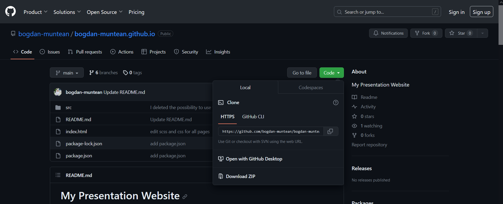
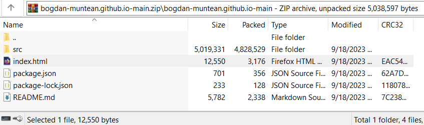

# My Presentation Website


<!-- Improved compatibility of back to top link: See: https://github.com/othneildrew/Best-README-Template/pull/73 -->
<a name="readme-top"></a>

<!-- PROJECT SHIELDS -->
<!--
*** I'm using markdown "reference style" links for readability.
*** Reference links are enclosed in brackets [ ] instead of parentheses ( ).
*** See the bottom of this document for the declaration of the reference variables
*** for contributors-url, forks-url, etc. This is an optional, concise syntax you may use.
*** https://www.markdownguide.org/basic-syntax/#reference-style-links
-->
[![LinkedIn][linkedin-shield]][linkedin-url]
[![MIT License][license-shield]][license-url]
 


<!-- PROJECT LOGO -->
<br />
<div align="center">
  <a href="https://github.com/bogdan-muntean/bogdan-muntean.github.io">
    
  </a>

<h3 align="center">My Personal Website</h3>

  <p align="center">
    Welcome to my personal website! This repository contains the source code and assets for my personal website. Feel free to explore, provide feedback, or contribute if you'd like.
    <br />
    <br />
    <a href="https://github.com/bogdan-muntean/bogdan-muntean.github.io">View Demo</a>
    ·
    <a href="https://github.com/bogdan-muntean/bogdan-muntean.github.io/issues">Report Bug</a>
  </p>
</div>


<!-- TABLE OF CONTENTS -->
<details>
  <summary>Table of Contents</summary>
  <ol>
    <li>
      <a href="#about-the-project">About The Project</a>
    </li>
    <li>
      <a href="#technologies-used">Technologies Used</a>
    </li>
    <li>
      <a href="#getting-started">Getting Started</a>
      <ul>
        <li><a href="#installation">Installation</a>
            <ol>
                <li><a href="#download-zip-method">Download ZIP method</a></li>
                <li><a href="#visual-studio-code-method">Visual Studio Code method</a></li>
            </ol>
        </li>
      </ul> 
    </li>
    <li><a href="#license">License</a></li>
    <li><a href="#contact">Contact</a></li>
  </ol>
</details>


<!-- ABOUT THE PROJECT -->
## About The Project

[![Screen Shot for Home Page from Project][product-screenshot]](https://bogdan-muntean.github.io/)

This website serves as a platform to showcase my portfolio and other personal projects. It's a place for me to share my thoughts, experiences, and work with the world.

Here are some key features of the website:
- Portfolio: A collection of my projects, with descriptions and links.
- Contact: A way for visitors to get in touch with me.

<p align="right">(<a href="#readme-top">back to top</a>)</p>


## Technologies Used

The website is built using the following technologies:
- HTML5
- CSS3
- SCSS
- JavaScript (ES6+)

<p align="right">(<a href="#readme-top">back to top</a>)</p>


<!-- GETTING STARTED -->
## Getting Started

To view the project instantly, click on the link: https://bogdan-muntean.github.io/

This will open the project in the browser.

If it was not successfully completed, you do not have access to the Internet or the project is not live, you must install the project locally and then run it.

### Instalation

#### Download ZIP method

1. Go to GitHub and click on Code -> Download ZIP


<!-- ![Instalation zip photo 1][instalation-zip-1] -->
2. Open the ZIP and double-click on 'bogdan-muntean.github.io-main' folder


<!-- ![Instalation zip photo 2][instalation-zip-2] -->
3. Double-click on 'index.html'


<!-- ![Instalation zip photo 3][instalation-zip-3] -->


#### Visual Studio Code method

1. Install Visual Studio Code: https://code.visualstudio.com/download
2. Install Git: https://git-scm.com/book/en/v2/Getting-Started-Installing-Git
3. Open Visual Studio Code
4. In Visual Studio Code, click on 'File' from top-left navigation bar -> click on Open Folder... -> select folder where do you want to add the repo -> click 'Select folder'.
5. Under the 'Explorer' text from left of the screen, right click on the Folder where do you want to add the repo -> left click on 'Open in integrated terminal'
6. Write in terminal to clone the repo into the folder
   ```sh
   git clone https://github.com/bogdan-muntean/bogdan-muntean.github.io.git
   ```
7. Navigate to the project directory
   ```sh
   cd bogdan-muntean.github.io
   ```
8. Open the project
   ```sh
   index.html
   ```

<p align="right">(<a href="#readme-top">back to top</a>)</p>


<!-- LICENSE -->
## License

Distributed under the MIT License. See `LICENSE.txt` for more information.

<p align="right">(<a href="#readme-top">back to top</a>)</p>


<!-- CONTACT -->
## Contact

Thank you for visiting my personal website repository! If you have any questions or feedback, please don't hesitate to contact me. Enjoy your stay!

My social accounts:
- [LinkedIn](https://www.linkedin.com/in/bogdan-muntean-ro/)
- [Facebook](https://www.facebook.com/bogdan.muntean.ro/)
- [Twitter](https://twitter.com/BogdanMuntean_) 
- [Github](https://github.com/bogdan-muntean)
- bm.bogdanmuntean@gmail.com

Project Link: [Live Link](https://bogdan-muntean.github.io/)

<p align="right">(<a href="#readme-top">back to top</a>)</p>


<!-- MARKDOWN LINKS & IMAGES -->
[license-shield]: https://img.shields.io/github/license/bogdan-muntean/bogdan-muntean.github.io.svg?style=for-the-badge
[license-url]: https://github.com/bogdan-muntean/bogdan-muntean.github.io/blob/master/LICENSE.txt
[linkedin-shield]: https://img.shields.io/badge/-LinkedIn-black.svg?style=for-the-badge&logo=linkedin&colorB=555
[linkedin-url]: https://linkedin.com/in/linkedin_username
[product-screenshot]: ./src/assets/readmeImages/home_page.png
[instalation-zip-1]: ./src/assets/readmeImages/readmeExplanationZip1.png
[instalation-zip-2]: ./src/assets/readmeImages/readmeExplanationZip2.png
[instalation-zip-3]: ./src/assets/readmeImages/readmeExplanationZip3.png
